# Delta-Sigma-Modulator

Delta-Sigma modulator (DSM) for fractional phase locked loop.

## File Structure

~~~bash
.
├── HK-MASH-DDSM  # HK-MASH or Traditional-MASH
│   ├── rtl       # verilog
│   └── tb        # testbench
├── SP-MASH-DDSM  # SP-MASH
│   ├── rtl
│   └── tb
├── PSD
│   ├── PSD.m     # Calculate the power spectral density
├── LICENSE
└── README.md
~~~

## Recommended parameter settings

**Traditional MASH DSM**

> top: *HK-MASH-DDSM/rtl/hk_mash111.v*

| parameter | value |
| --------- | ----- |
| WIDTH     | 9     |
| A_GAIN    | 0     |
| OUT_REG   | 1     |

**HK-MASH DSM**

> top: *HK-MASH-DDSM/rtl/hk_mash111.v*

| parameter | value |
| --------- | ----- |
| WIDTH     | 9     |
| A_GAIN    | 2     |
| OUT_REG   | 1     |

**SP-MASH DSM**

> top: *SP-MASH-DDSM/rtl/sp_mash111.v*

| parameter | value |
| --------- | ----- |
| WIDTH     | 9     |
| OUT_REG   | 1     |

---

## Analysis

### Traditional MASH DSM

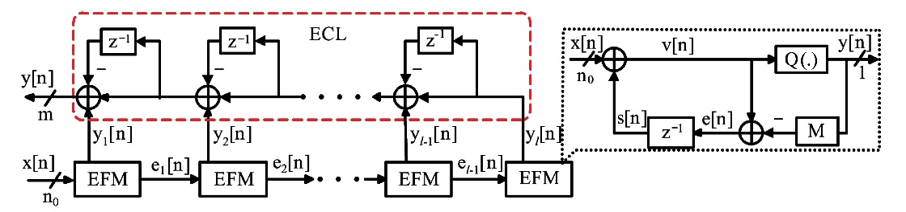

In *HK-MASH-DDSM/rtl/hk_mash111.v*, when parameter `A_GAIN` is set to `0`, `hk_mash111` works in traditional mode.

When input width(parameter `WIDTH` in `hk_mash111`) is set to 24bit(`WIDTH = 24`) and the input is 0.5(`x_i = 2^23`), the Power Spectral Density(PSD) of output is shown in the figure below.

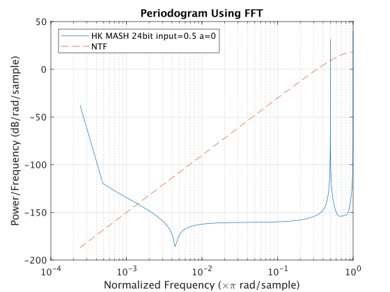

### HK-MASH DSM

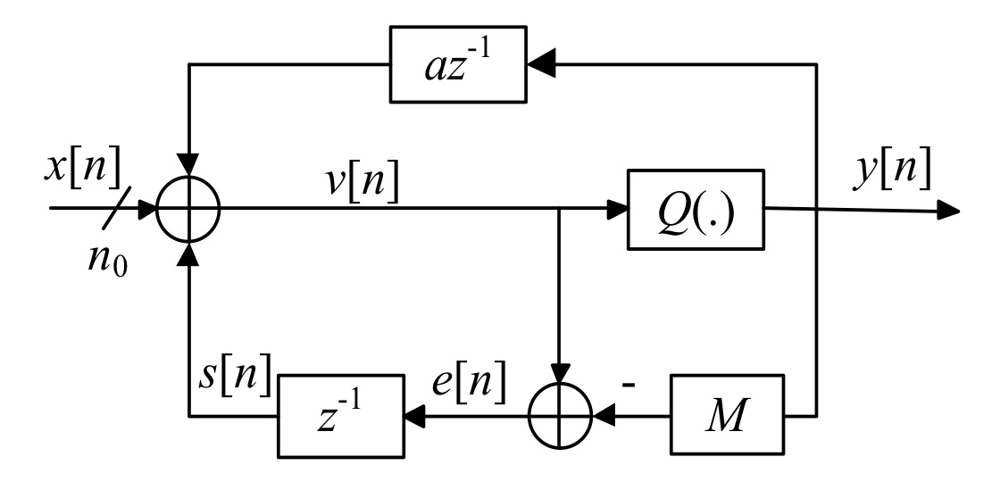

In *HK-MASH-DDSM/rtl/hk_mash111.v*, when parameter `A_GAIN` is not equal to `0`, `hk_mash111` works in **HK-MASH** mode.

The relationship between coefficient a and parameter `A_GAIN` in `hk_mash111` is shown in the following formula.

~~~
a = A_GAIN*2-1
~~~

Parameter detail:

| parameter | value |
| --------- | ----- |
| WIDTH     | 24    |
| A_GAIN    | 2     |
| OUT_REG   | 0     |

When input width(parameter `WIDTH` in `hk_mash111`) is set to 24bit(`WIDTH = 24`) and the input is 0.5(`x_i = 2^23`), the Power Spectral Density(PSD) of output is shown in the figure below.

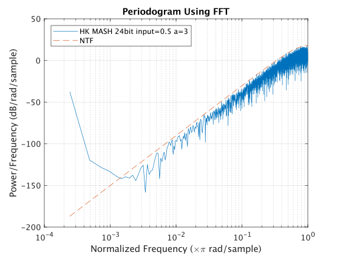

### SP-MASH DSM

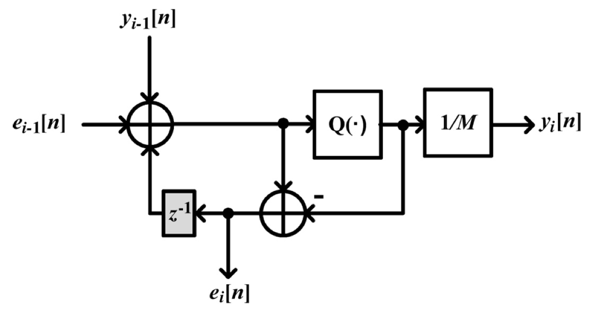

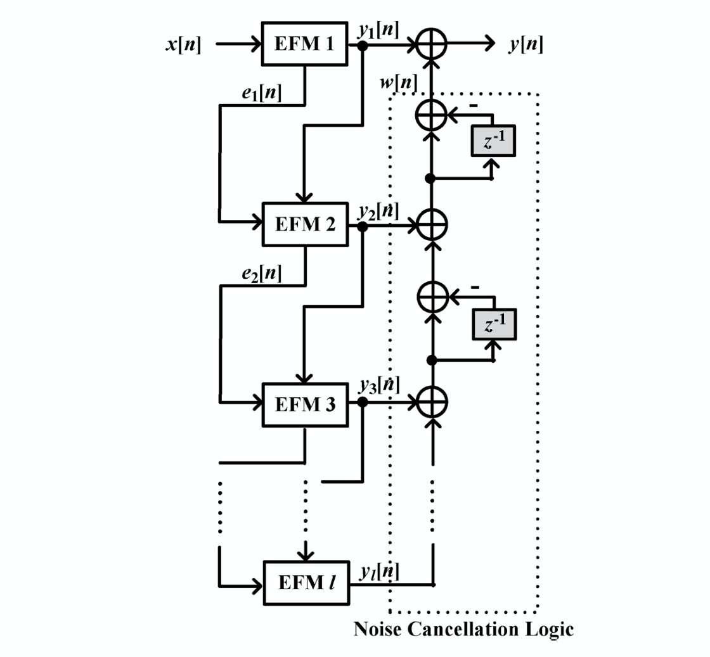

When every EFM's input width is set to the same width, this structure operates bad. The following figure is the PSD of output when input is 0.5 of 24bit:

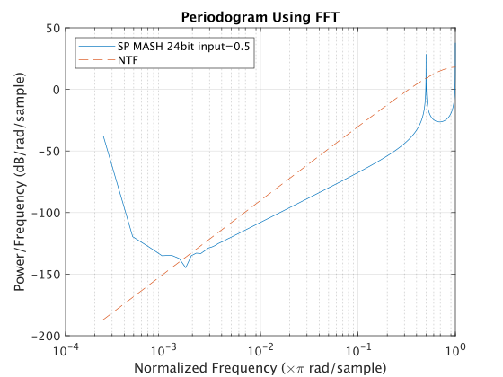

So change the structure like this:

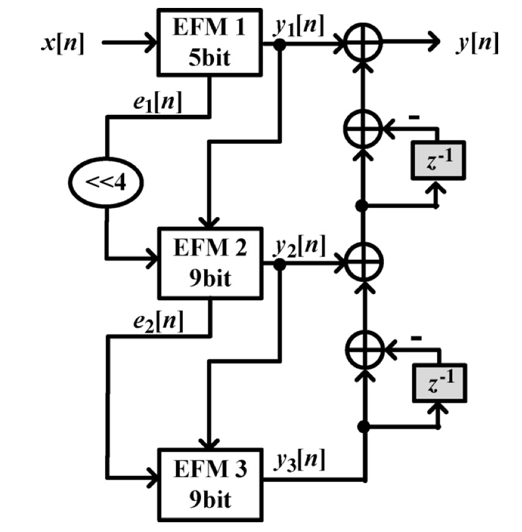

The input width of the first EFM is set to 5bit, other EFM input width is 9bit. Shift `e_1` to the left by 4bits as the input of the second stage EFM.

Parameter detail:

| parameter | value |
| --------- | ----- |
| WIDTH     | 9     |
| OUT_REG   | 0     |

Power Spectral Density(PSD) of output is shown in the figure below.

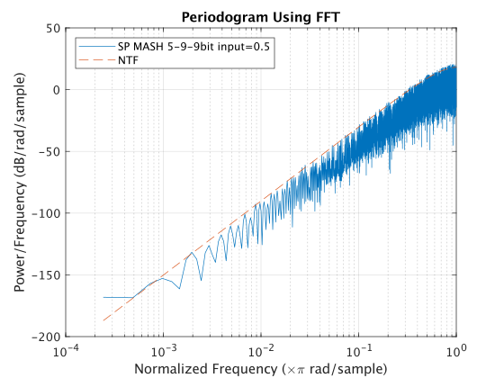

## Improve

When the DSM of the above three structures is mapped to the circuit, you will find that there is a long logic path collecting all the adders. This can limit the operating frequency of the circuit. A sample way to avoid this is adding registers to cutoff long logic path.

However, if we add one register between two adjacent EFM, it can strengthen the noise at certain frequencies.

PSD of HK-MASH when input is 0.5 of 24bit with one output register:

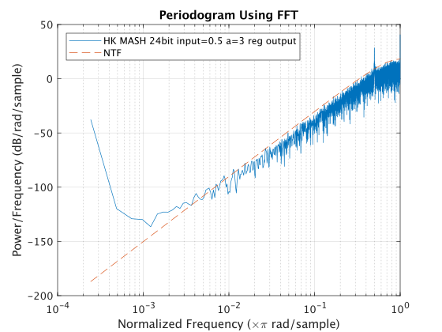

PSD of SP-MASH when input is 0.5 with one output register:

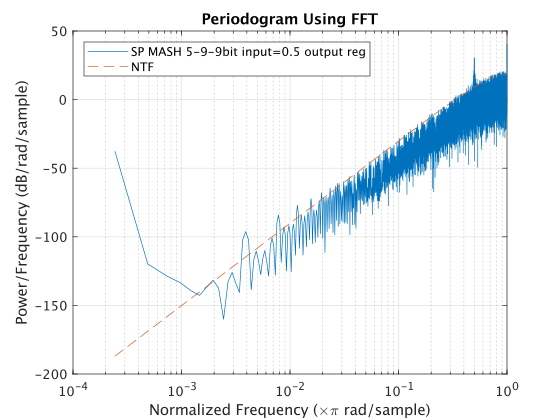

In order to match the timming of output, we add three registers to the first EFM output, add two registers to second EFM output and add one register to the last EFM output.

**HK-MASH DSM 1:**

Parameter detail:

| parameter | value |
| --------- | ----- |
| WIDTH     | 24    |
| A_GAIN    | 2     |
| OUT_REG   | 1     |

PSD(input 0.5):

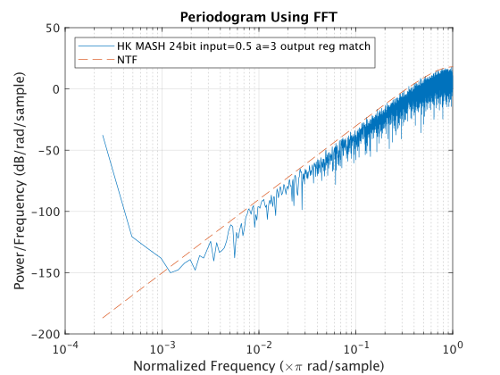

**HK-MASH DSM 2:**

Parameter detail:

| parameter | value |
| --------- | ----- |
| WIDTH     | 9     |
| A_GAIN    | 2     |
| OUT_REG   | 1     |

PSD(input 0.5):

**SP-MASH DSM:**

Parameter detail:

| parameter | value |
| --------- | ----- |
| WIDTH     | 9     |
| OUT_REG   | 1     |

PSD(input 0.5):

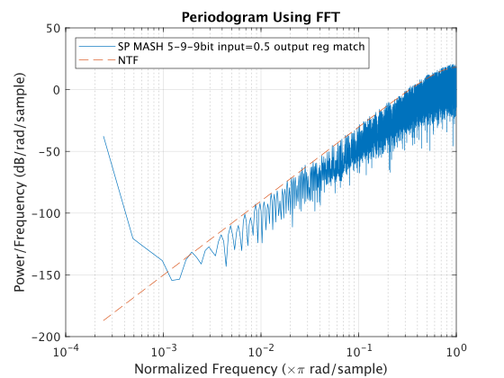